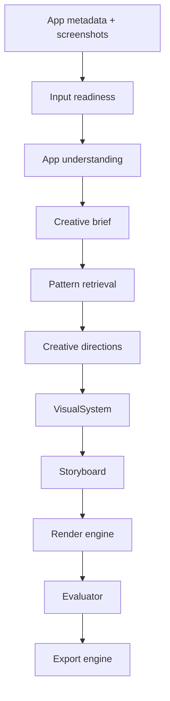

# Architecture

## System overview

App Screenshot AI is split into independent packages so the AI pipeline can evolve into a hosted product later without rewriting the core.



## Package boundaries

### `packages/schemas`

Shared Zod schemas and TypeScript types.

Core contracts:

- `AppInput`
- `RawScreenshot`
- `InputReadinessReport`
- `ScreenshotAnalysis`
- `AppContext`
- `CreativeBrief`
- `DesignPattern`
- `CreativeDirection`
- `VisualSystem`
- `ScreenPlan`
- `Storyboard`
- `RenderPlan`
- `RenderedAsset`
- `QualityReport`
- `ExportManifest`

### `packages/model-gateway`

Provider abstraction for BYOK model calls.

Responsibilities:

- provider selection,
- key validation,
- structured object generation,
- multimodal messages,
- schema validation,
- error normalization,
- provider metadata.

Initial interface target:

```ts
await modelGateway.generateObject({
  provider: "gemini",
  model: "gemini-2.5-flash",
  task: "creative-directions.generate",
  schema: CreativeDirectionsSchema,
  input,
});
```

Normalized errors:

- `invalid_key`
- `quota_exceeded`
- `rate_limited`
- `provider_down`
- `content_blocked`
- `timeout`
- `schema_validation_failed`
- `unknown_provider_error`

### `packages/ai-pipeline`

Orchestrates the product flow.

Steps:

1. `checkInputReadiness()`
2. `analyzeScreenshots()`
3. `buildAppContext()`
4. `buildCreativeBrief()`
5. `retrievePatterns()`
6. `generateCreativeDirections()`
7. `generateVisualSystem()`
8. `generateStoryboard()`
9. `compileRenderPlan()`

The pipeline should never know provider-specific SDK details.

### `packages/pattern-library`

Curated abstract design patterns.

Rules:

- no copied competitor templates,
- no trademarked layouts,
- patterns describe principles, constraints, and conversion intent,
- retrieval can start as simple filtering before vector search exists.

### `packages/render-engine`

Deterministic final rendering.

Responsibilities:

- compose background,
- place screenshot/device frame,
- render editable text as real text,
- apply `VisualSystem` layout rules,
- export PNGs in store sizes.

Preferred v1 approach:

- HTML/CSS composition,
- Playwright/Chromium screenshot export.

### `packages/evaluator`

Quality and compliance scoring.

Initial checks:

- input screenshot count,
- output dimensions,
- headline length,
- contrast,
- safe areas,
- visual system consistency,
- store format constraints,
- UI visibility.

Later:

- multimodal judge,
- provider comparison scoring,
- benchmark reports.

### `packages/export-engine`

Creates export manifest and ZIP.

Target folder shape:

```txt
exports/
  app-store/iphone-6.9/en-US/*.png
  google-play/phone/en-US/*.png
  manifest.json
```

### `packages/local-project-store`

Filesystem-backed local persistence for v1.

Responsibilities:

- create local project folders,
- write input metadata,
- write inspectable pipeline JSON artifacts,
- write rendered PNGs,
- write exported ZIPs.

## Apps

### `apps/web`

Local-first UI.

Primary screens:

1. Provider settings.
2. Project setup.
3. Screenshot upload/readiness.
4. Creative directions.
5. Visual system/storyboard preview.
6. Rendered screenshots.
7. Quality report/export.

No hosted auth/payments in v1.

## Data persistence

v1 uses filesystem project folders through `packages/local-project-store`:

```txt
.local/projects/{projectId}/
  input/
    metadata.json
    screenshots/
  pipeline/
    input-readiness.json
    visual-system.json
    storyboard.json
    quality-report.json
    export-manifest.json
  renders/
  exports/
```

This keeps local-first simple, makes every pipeline artifact inspectable, and avoids premature database complexity.

A hosted product can later replace this with Postgres/S3/workers.

## Provider comparison path

v1:

- one active provider/model per run,
- generation metadata is saved.

v1.1:

- benchmark mode runs same input against multiple providers,
- evaluator compares outputs,
- user chooses winning direction/provider.

## Product-to-SaaS migration path

Keep packages environment-agnostic.

Later hosted architecture:

```txt
Next.js app -> API -> queue -> render workers -> object storage
```

Commercial features should wrap the same core packages instead of forking the product.
