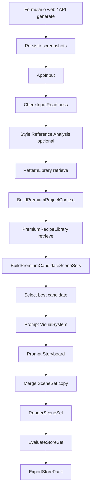

# Arquitectura de generación de screenshots

Este documento describe, de punta a punta, cómo se crean los screenshots en **App Screenshot AI**: entradas, contratos, prompts, variantes visuales, render, evaluación y exportación. Sirve como documento de evaluación técnica y de producto.

## 1. Objetivo del sistema

El sistema genera packs de screenshots para App Store / Google Play a partir de:

- metadata de la app,
- screenshots funcionales reales,
- categoría,
- audiencia,
- propuesta de valor,
- colores/branding opcionales,
- landing page opcional,
- referencia visual estándar seleccionada.

La idea central actual es:

```txt
Input app + screenshots + referencia visual
  -> readiness
  -> contexto premium de producto/marca
  -> recetas premium + variantes
  -> prompts estructurados para IA
  -> storyboard/copy
  -> SceneSet final
  -> render determinista PNG
  -> evaluación
  -> ZIP/export manifest
```

Principio clave: **la IA decide copy, lectura visual y dirección; el renderer determinista compone el resultado final para que sea repetible e inspeccionable.**

---

## 2. Módulos principales

| Paquete / app | Responsabilidad |
|---|---|
| `apps/web` | UI local-first, subida de screenshots, selección de provider/modelo/referencia, endpoints API. |
| `packages/schemas` | Contratos Zod/TypeScript: `AppInput`, `BrandKit`, `ProductUnderstanding`, `PremiumRecipe`, `SceneSet`, `Storyboard`, `QualityReport`, etc. |
| `packages/ai-pipeline` | Orquestación completa de generación. Caso central: `GenerateStorePackUseCase`. |
| `packages/model-gateway` | Abstracción de providers: OpenAI, Gemini, fixture. Normaliza JSON estructurado, imágenes y errores. |
| `packages/pattern-library` | Patrones legacy y `PremiumRecipeLibrary` por categoría. |
| `packages/render-engine` | Render determinista SVG/Sharp de `Storyboard` o `SceneSet`. También compone backgrounds generados por IA. |
| `packages/evaluator` | Evalúa dimensiones, copy, diversidad, composición premium, profundidad, continuidad, proof, etc. |
| `packages/export-engine` | Crea manifest y ZIP final. |
| `packages/local-project-store/session` | Persistencia local de generaciones y artefactos. |

---

## 3. Flujo completo de generación

Implementación principal: `packages/ai-pipeline/src/features/generate-store-pack/generate-store-pack.ts`.



### Paso a paso

1. **API recibe formulario** (`apps/web/app/api/generate/route.ts`)
   - Guarda screenshots en `.local/projects/{projectId}/input/screenshots`.
   - Construye `AppInput`.
   - Lee referencia visual seleccionada (`sc-1` a `sc-4`) desde `apps/web/public/style-references`.
   - Configura provider (`gemini`, `openai`, `fixture`) y modelos.

2. **Readiness**
   - Bloquea si hay pocos screenshots o demasiados splash/logo/empty.
   - Regla base: al menos 3 screens funcionales para generar con calidad.

3. **Style reference analysis**
   - Para Gemini/OpenAI no OpenAI-first, se analiza la imagen de referencia como dirección visual.
   - Output: `StyleReferenceAnalysis`.

4. **Contexto premium**
   - `BuildPremiumProjectContextUseCase` crea:
     - `BrandKit`.
     - `ProductUnderstanding`.
   - Prioridad de branding:
     1. colores manuales,
     2. landing page,
     3. defaults por categoría.

5. **Receta premium**
   - `PremiumRecipeLibrary` selecciona recetas por categoría y tono.
   - Ejemplos:
     - `travel-editorial-panorama`,
     - `utility-blue-depth`,
     - `finance-trust-proof`,
     - `fitness-neon-energy`,
     - `education-bright-cards`,
     - `social-avatar-gradient`.

6. **Variantes premium**
   - `BuildPremiumCandidateSceneSetsUseCase` genera 5 variantes:
     - `balanced`,
     - `object-rich`,
     - `split-heavy`,
     - `dark-premium`,
     - `director-cut`.
   - Cada variante se evalúa con `EvaluateStoreSetUseCase` y se selecciona la mejor.

7. **IA estructurada**
   - Se llama al modelo para:
     - `visual-system.generate`,
     - `storyboard.generate`.
   - Los prompts no son texto suelto: se manda un JSON con `app`, `patterns`, `styleReference`, `styleReferenceAnalysis`, `landingPage`, `outputContract`.

8. **SceneSet final**
   - El `SceneSet` elegido aporta estructura visual premium.
   - El `Storyboard` generado por IA aporta copy y selección narrativa.
   - Se hace merge de copy/callouts sobre el `SceneSet`.

9. **Render**
   - Si hay `SceneSet`: `RenderSceneSetUseCase`.
   - Si no hay: fallback legacy `RenderStoreSetUseCase` con `VisualSystem + Storyboard`.
   - Render actual: SVG construido en código + `sharp` a PNG.

10. **Evaluación y export**
   - Quality report.
   - ZIP y manifest.

---

## 4. Contratos de datos importantes

### `AppInput`

Entrada universal:

```ts
type AppInput = {
  appName: string;
  category: string;
  targetAudience: string;
  mainValueProposition: string;
  screenshots: Array<{ id: string; path: string; kind: "functional" | "splash" | "logo" | "empty" | "unknown" }>;
  targetStores: Array<"app-store" | "google-play">;
  baseLocale: string;
  brand?: {
    colors?: string[];
    logoPath?: string;
    websiteUrl?: string;
  };
};
```

### `BrandKit`

Fuente visual del proyecto:

```ts
type BrandKit = {
  source: "manual" | "landing" | "screenshots" | "mixed" | "category-default";
  palette: {
    background: string;
    surface: string;
    text: string;
    primary: string;
    accent: string;
    secondary?: string;
  };
  typography: {
    displayFamily?: string;
    uiFamily?: string;
    weight: number;
    mood: "serif-editorial" | "modern-saas" | "bold-sport" | "friendly";
  };
  imagery: {
    style: "none" | "3d" | "photo" | "illustration" | "avatar" | "abstract";
    keywords: string[];
  };
  tone: string[];
};
```

### `ProductUnderstanding`

Entendimiento del producto y screens:

```ts
type ProductUnderstanding = {
  appName: string;
  category: string;
  valueProposition: string;
  audience: string;
  landingPage?: LandingPageContext;
  screenInventory: Array<{
    screenshotId: string;
    sourcePath: string;
    role: "home" | "search" | "detail" | "map" | "profile" | "checkout" | "unknown";
    dominantColors: string[];
    visualDensity: "low" | "medium" | "high";
    bestFor: Array<"hook" | "feature" | "proof" | "comparison" | "cta">;
  }>;
};
```

Actualmente el análisis de screenshots es heurístico por nombre/path. No hay visión real de cada screenshot todavía.

### `PremiumRecipe`

Receta premium reutilizable:

```ts
type PremiumRecipe = {
  id: string;
  category: string;
  name: string;
  qualityTarget: "premium" | "top-1-percent";
  tone: string[];
  setRhythm: ["hook", "feature", "proof", "comparison", "cta"];
  scenes: Array<{
    composition:
      | "hero-poster"
      | "split-devices"
      | "cropped-edge-device"
      | "proof-poster"
      | "object-led"
      | "before-after"
      | "panoramic-sequence";
    requiredAssets: Array<"3d-object" | "badge" | "gradient" | "photo" | "avatar" | "none">;
    deviceSlots: number;
    copyStyle: "big-loud" | "minimal-premium" | "proof-heavy";
  }>;
};
```

### `SceneSet`

Contrato que realmente renderiza el pipeline premium:

```ts
type SceneSet = {
  id: string;
  brandKit: BrandKit;
  recipeId: string;
  continuity: {
    sharedBackground: "gradient" | "panorama" | "photo-blur" | "solid";
    recurringObjects: string[];
    deviceTreatment: "consistent" | "progressive";
  };
  backgroundPlates?: BackgroundPlateSpec[];
  scenes: Scene[];
};
```

Una `Scene` define copy, background, dispositivos, objetos y callouts.

---

## 5. Prompts y contratos de IA

Archivo principal: `packages/ai-pipeline/src/features/generate-store-pack/ai-task-contracts.ts`.

La arquitectura usa **prompts estructurados por contrato**, no prompts libres. El provider recibe:

```txt
You are App Screenshot AI. Task: {task}. Return only valid JSON.

Input:
{JSON.stringify(input, ..., 2)}
```

El `input` incluye un `outputContract` con shape esperado y constraints.

### 5.1 Prompt: `style-reference.analyze`

Objetivo: analizar la referencia visual seleccionada como fuente de dirección artística.

**Input:**

- `app`,
- `styleReference` con imagen adjunta,
- `outputContract`.

**Output:** `StyleReferenceAnalysis`:

```ts
type StyleReferenceAnalysis = {
  referenceId: string;
  visualSummary: string;
  layoutRhythm: string[];
  typographyStyle: string[];
  colorAndLighting: string[];
  compositionRules: string[];
  forbiddenCarryovers: string[];
};
```

**Constraints relevantes:**

- devolver solo JSON válido,
- analizar composición, tipografía, colores, lighting, density, device placement, hierarchy, decorations y set rhythm,
- listar carryovers prohibidos: app names, text, logos, trademarks, faces, exact UI,
- no copiar elementos específicos de la referencia.

### 5.2 Prompt: `visual-system.generate`

Objetivo: generar sistema visual legacy/compatibilidad.

**Output:** `VisualSystem`:

```ts
type VisualSystem = {
  id: string;
  layoutFamily: "classic-device" | "map-route-editorial" | "premium-proof-cards" | "cinematic-atlas";
  motif: "route-line" | "cards" | "atlas-glow" | "none";
  palette: { background: string; primary: string; accent: string; text: string };
  typography: { headlineFamily: string; headlineWeight: number };
  layout: { safeMargin: number; headlineY: number; deviceY: number; deviceWidthRatio: number };
};
```

**Constraints:**

- JSON válido.
- `layoutFamily` permitido: `map-route-editorial`, `premium-proof-cards`, `cinematic-atlas`, `classic-device`.
- Para travel/literary preferir `map-route-editorial` salvo que otra opción encaje mejor.
- Usar hex colors.
- `deviceWidthRatio` entre `0.45` y `0.75`.
- Adaptar referencia visual sin copiar texto/UI/trademarks/brand identity.
- Screenshots reales y metadata son fuente de verdad.
- No mencionar LiteraryTrip/libros/rutas salvo que el input lo diga explícitamente.

### 5.3 Prompt: `storyboard.generate`

Objetivo: generar copy y planificación narrativa de screenshots.

**Output:** `Storyboard`:

```ts
type Storyboard = {
  screens: Array<{
    id: string;
    index: number;
    role: string;
    headline: string;
    subheadline?: string;
    treatment?: "hero-device" | "map-route-editorial" | "premium-proof-card" | "cinematic-poster" | "callout-zoom";
    sourceScreenshotPath: string;
    secondarySourceScreenshotPath?: string;
    device?: { scale?: number; tilt?: number; crop?: string };
    callouts?: Array<{ label: string; x: number; y: number }>;
  }>;
};
```

**Constraints principales:**

- devolver exactamente `screenCount` screens,
- si `includeCoverScreen` está activo: screen 1 es portada extra, el resto mapea a screenshots subidos,
- si no: una screen por screenshot subido,
- usar al menos 3 treatments distintos en sets de 5,
- headline máximo 8 palabras,
- usar solo paths existentes en `app.screenshots`,
- usar `secondarySourceScreenshotPath` en 1-2 pantallas, no en todas,
- índices 1..5,
- preservar ritmo/hierarchy de la referencia,
- no copiar referencia,
- no inventar temas de LiteraryTrip/libros si no están en metadata.

---

## 6. Prompts de generación de imágenes OpenAI

Hay dos modos con imagen generativa.

### 6.1 OpenAI-first reference composition

Función: `buildAiFirstCompositionPrompt`.

Se activa cuando `provider === "openai"` en el branch `useAiFirstReferenceComposition`.

Objetivo: crear background/stage completo inspirado en la referencia, sin UI falsa ni teléfonos. Luego el sistema compone encima screenshots reales y texto determinista.

El prompt fuerza tres fases:

1. **Extract Visual DNA**
   - style,
   - campaign mood,
   - color palette,
   - lighting,
   - camera/perspective,
   - hierarchy,
   - spacing,
   - device/screenshot placement strategy,
   - premium cues,
   - depth/shadow/glow.

2. **Adapt DNA**
   - app name,
   - category,
   - audience,
   - value proposition,
   - scene role,
   - headline solo como espacio reservado.

3. **Build New Scene**
   - composición original,
   - misma sensación premium,
   - no copiar objetos/layout/texturas concretas.

**Reglas críticas:**

- No generar texto legible.
- No generar app UI.
- No generar teléfonos.
- Crear placeholder/stage si no es portada.
- Portada: sin screenshot area.
- Evitar logos, marcas, faces, people, watermarks, lorem ipsum.
- Negative prompt específico bloquea LiteraryTrip/books/map pins genéricos salvo que metadata lo requiera.

### 6.2 Style background edit

Función: `buildReferenceEditPrompt`.

Objetivo: adaptar referencia a un fondo vertical App Store para cada `Scene`.

Reglas:

- Output solo background/stage.
- Cero letras, palabras, números, slogans, fake UI labels.
- No dibujar teléfonos ni app UI.
- Preservar ritmo visual: typography zones, phone-stage energy, saturated lighting, depth, shadows, decorative density.
- El renderer añadirá screenshot real y texto final.

---

## 7. Variantes generadas

Archivo: `packages/ai-pipeline/src/features/premium-planning/build-premium-candidates.ts`.

### `balanced`

Base directa desde `BuildPremiumSceneSetUseCase`.

- Respeta la receta.
- Mantiene composición equilibrada.
- Buena baseline para comparar.

### `object-rich`

Añade más objetos decorativos y profundidad.

- Más recurring objects: `depth-cubes`, `floating-cards`.
- Más background `mesh`.
- Aumenta tilt/depth de devices.
- Añade 1-2 objetos por escena.

Útil para evaluar si el set gana look premium o se vuelve demasiado cargado.

### `split-heavy`

Convierte escenas intermedias en `split-devices`.

- Dos devices con tilt opuesto.
- Segundo device recortado a borde.
- Callout “Compare flows”.

Útil para features donde comparar estados/screens aumenta claridad.

### `dark-premium`

Convierte set a estética oscura/cinemática.

- Background `#080A12`.
- Surface `#111827`.
- Text blanco.
- Tono añade `cinematic`, `dark-premium`.
- Background `dark-stage`.

Útil para fitness, AI/social o productos que necesitan energía/contraste.

### `director-cut`

Variante más agresiva y premium.

- Continuity `panorama`.
- Device treatment `progressive`.
- Composiciones forzadas:
  1. `hero-poster`,
  2. `panoramic-sequence`,
  3. `split-devices`,
  4. `cropped-edge-device`,
  5. `object-led`.
- Más objetos.
- Más tilt/depth.

Es la variante que normalmente se prioriza si puntúa igual, porque `variantPriority()` le da prioridad máxima.

---

## 8. Recetas premium por categoría

Archivo: `packages/pattern-library/src/pattern-library.ts`.

| Categoría | Recipe id | Dirección |
|---|---|---|
| Travel | `travel-editorial-panorama` | Warm editorial, mapas/rutas, panorama, proof, split, object-led. |
| Utility | `utility-blue-depth` | Azul SaaS/productivity, profundidad, split devices, proof cards, cropped edge. |
| Finance | `finance-trust-proof` | Verde/trust, proof system, badges, seguridad, monedas/cards. |
| Fitness | `fitness-neon-energy` | Dark/neon, energía, trophies/rings, object-led. |
| Education | `education-bright-cards` | Bright learning cards, friendly, before/after. |
| Social | `social-avatar-gradient` | Avatars, gradients, social proof, split/object scenes. |

La selección normaliza categorías:

- `productivity`, `tools`, `business` -> `utility`,
- `navigation`, `maps`, `lifestyle` -> `travel`,
- `fintech`, `banking`, `budget`, `money` -> `finance`,
- `health`, `wellness`, `sports` -> `fitness`,
- etc.

---

## 9. Render engine premium

Archivo: `packages/render-engine/src/render-scene-set.ts`.

### Técnica actual

- Construye SVG por escena.
- Inserta screenshots reales dentro de mockups de device.
- Renderiza objetos decorativos como SVG.
- Convierte SVG a PNG con `sharp`.
- Target App Store iPhone 6.9: `1320x2868`.

### Capas de render

Orden aproximado:

1. `<defs>` filtros, sombras, gradients.
2. Background base.
3. Art direction layer por categoría.
4. Continuity motif.
5. Composition backdrop.
6. Objetos detrás.
7. Proof poster.
8. Headline/subheadline.
9. Devices con screenshot real.
10. Objetos delante.
11. Callouts.
12. Marca diagnóstica de composition class.

### Art direction por categoría

`artDirectionFor(sceneSet)` decide según `brandKit.imagery.keywords`:

- keywords `books`, `maps`, `routes` -> `travel`,
- `coins`, `proof` -> `finance`,
- `rings`, `trophy`, `energy` -> `fitness`,
- fallback -> `utility`.

### Background plates

Archivo: `build-background-plates.ts`.

Tipos:

- `travel-map-sketch`,
- `utility-flow-system`,
- `finance-ledger-engraving`,
- `fitness-kinetic`,
- `abstract-material`.

Cada plate incluye:

- textura,
- motifs,
- palette base/ink/accent,
- safe zone.

### Composiciones soportadas

| Composition | Intención |
|---|---|
| `hero-poster` | Hook principal, device grande, mensaje claro. |
| `split-devices` | Dos pantallas comparadas o dos momentos del flujo. |
| `cropped-edge-device` | Device recortado al borde para look premium/editorial. |
| `proof-poster` | Tarjeta de confianza/rating/proof. |
| `object-led` | Objetos 3D/decorativos lideran la escena. |
| `before-after` | Comparación de dos estados. |
| `panoramic-sequence` | Continuidad visual entre screenshots. |

---

## 10. Evaluación de calidad

Archivo: `packages/evaluator/src/evaluate-store-set.ts`.

### Checks básicos

- Dimensiones App Store iPhone 6.9: `1320x2868`.
- Headline máximo 8 palabras.
- Al menos 3 treatments distintos en sets de 5.

### Scoring premium

Si hay `SceneSet`, evalúa:

| Métrica | Peso aproximado / función |
|---|---|
| `compositionDiversity` | Variedad de composiciones únicas. |
| `objectDepth` | Cantidad de objetos por escena. |
| `deviceRichness` | Multi-device, crop, tilt. |
| `continuity` | Background compartido, recurring objects, device treatment. |
| `benefitClarity` | Headline corto, empieza con verbo/valor, no genérico. |
| `screenshotPairing` | Uso de suficientes screenshots distintos y roles. |
| `proofSignal` | Presencia de proof/badge/trust/result. |
| `thumbnailReadability` | Headline/subheadline legibles en thumbnail. |

Rating:

- `>= 0.97`: `top-1-percent-candidate`,
- `>= 0.82`: `premium-candidate`,
- `>= 0.72`: `marketable`,
- `< 0.72`: `needs-iteration`.

Para ser top 1%, además del score, debe pasar gates estrictos de diversidad, objetos, devices, continuidad, claridad, pairing, proof y readability.

---

## 11. Persistencia y artefactos evaluables

La generación local guarda artefactos bajo:

```txt
.local/projects/{projectId}/
  input/
    screenshots/
  pipeline/
    input-readiness.json
    visual-system.json
    storyboard.json
    quality-report.json
    export-manifest.json
  renders/
  exports/
```

La respuesta API incluye:

- screenshots renderizados como data URL,
- `qualityReport`,
- `visualSystem`,
- `storyboard`,
- `exportManifest`,
- `brandKit`,
- `productUnderstanding`,
- `premiumRecipes`,
- `premiumCandidates`,
- `sceneSet`,
- `styleReference`,
- zip final.

---

## 12. Puntos fuertes actuales

- Arquitectura modular y limpia.
- Contratos Zod claros.
- Provider gateway separa IA del pipeline.
- Render determinista con screenshots reales, no UI inventada.
- Variantes premium ya modeladas.
- Evaluador premium más fuerte que un simple dimension checker.
- Artefactos JSON inspeccionables.
- Referencias visuales estándar permiten comparar estilos.

---

## 13. Limitaciones actuales para evaluar

1. **Análisis de screenshots todavía heurístico**
   - Se infiere role por filename/path.
   - No hay visión real del contenido del screenshot.

2. **`SceneSet` no lo genera la IA directamente**
   - Actualmente se construye determinísticamente desde receta + contexto.
   - La IA aporta `Storyboard`/copy y `VisualSystem`.

3. **Assets premium son SVG/faux-3D, no librería real**
   - Objetos como cube, coin, trophy, map-pin se dibujan en SVG.

4. **Evaluador no es multimodal**
   - Puntúa estructura JSON, no mira la imagen final con visión.

5. **OpenAI branch mezcla dos estrategias**
   - Existe modo AI-first composition para backgrounds/stages.
   - En branch principal, `generatedStyleBackgrounds` solo se usa con OpenAI y referencia con base64.

6. **Prompts están embebidos en código**
   - No hay versionado externo ni A/B testing formal de prompts.

---

## 14. Criterios sugeridos para evaluación

Al evaluar el sistema, revisar:

1. **Calidad visual final**
   - ¿Parece App Store premium?
   - ¿Tiene profundidad real?
   - ¿Hay variedad entre pantallas?

2. **Fidelidad al producto**
   - ¿El copy corresponde a la app?
   - ¿Los screenshots correctos se usan en roles adecuados?
   - ¿No aparecen elementos de otros ejemplos como LiteraryTrip si no toca?

3. **Respeto a referencia visual**
   - ¿Adapta el ADN visual sin copiar texto/logos/objetos?

4. **Legibilidad**
   - ¿Headline se lee en thumbnail?
   - ¿Screenshot real sigue visible?

5. **Continuidad de set**
   - ¿Las 5 piezas se sienten de la misma campaña?

6. **Diferenciación por categoría**
   - Utility, finance, fitness y travel deberían verse estructuralmente distintos, no solo cambiar color.

7. **Robustez técnica**
   - ¿Genera ZIP y manifest?
   - ¿No falla con providers?
   - ¿Guarda artefactos para debug?

---

## 15. Próximos pasos recomendados

1. Añadir `AnalyzeScreenshotsUseCase` con visión real.
2. Generar `SceneSet` por IA con schema validado, no solo deterministic recipe.
3. Externalizar/versionar prompts.
4. Añadir multimodal evaluator sobre contact sheet.
5. Crear asset packs reales por categoría.
6. Guardar todas las variantes renderizadas, no solo selected winner.
7. Añadir benchmark report comparando provider/model/style reference.
8. Crear loop de reparación: score bajo -> repair instructions -> rerender.
